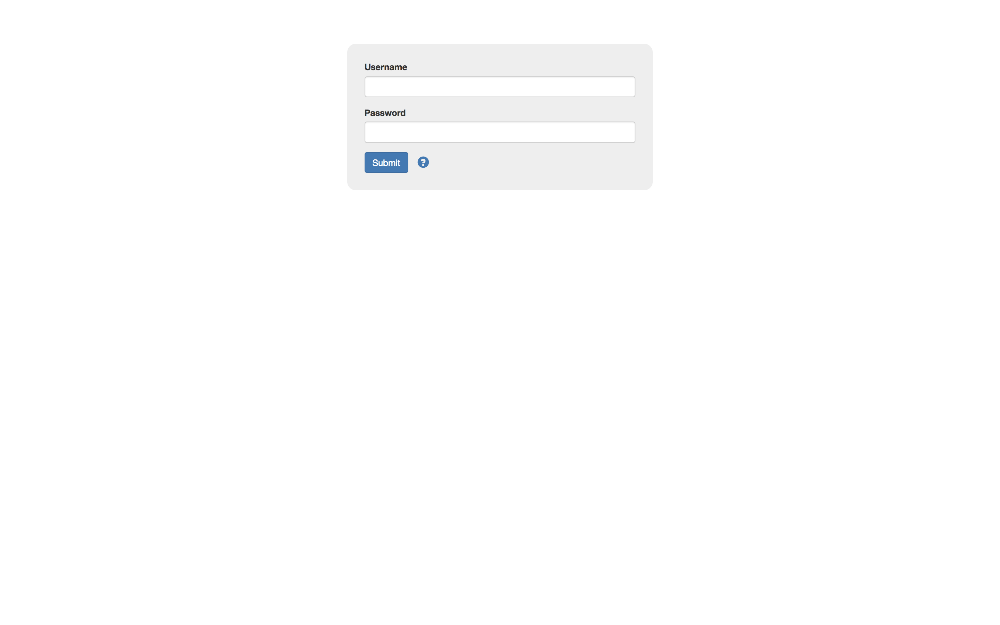
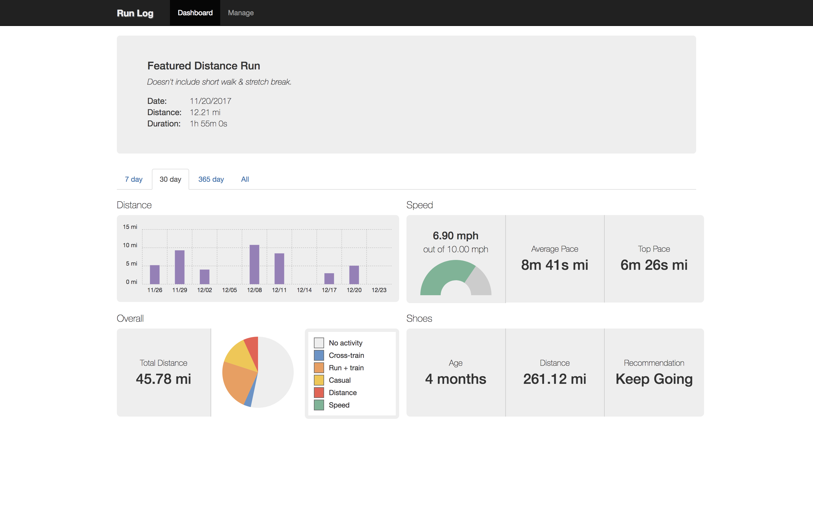
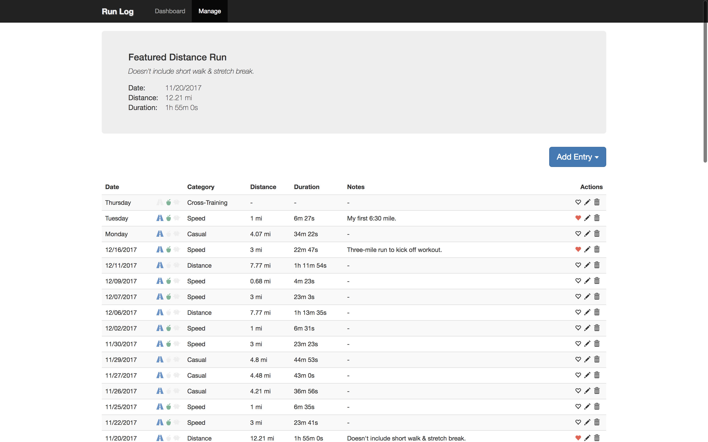
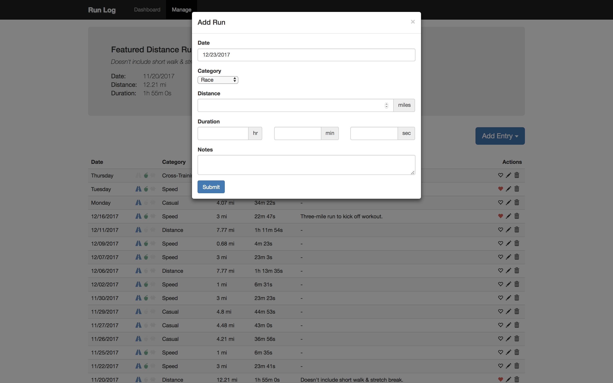

# Run Log

## Overview
Web application for logging runs and tracking progress. Includes an AWS serverless backend and React-based frontend.

If you'd like more information on the product and the technical approach,  [review this presentation](https://docs.google.com/presentation/d/1A99DvfPVWyc-2TcBnq0_8jJZ-GgUx-0bhkbwZQlP6-s).

## Important warning about security

**Read this before running the application.**

The authentication mechanism is not secure, because:

* The credentials are stored as part of the front-end application state, and are hence exposed as plain text to debugging tools (e.g., React Developer Tools)
* Valid credentials stored in environment variable in CI/CD and lambdas as plain text

Do _not_ reuse credentials with any other system, and treat the credentials as insecure. Do not store sensitive information.

Note that this application uses SSL to transmit HTTP requests, so the use of HTTP Basic Authentication should be secure. It is the manner in how this information is stored in frontend and backend that is not sufficiently secure; not how credentials are transferred.

This warning will be removed once a more secure authentication method is used. Meanwhile, treat this like a demonstration application.

## Repository structure
* `.circleci/config.yml`: CI/CD configuration, using CircleCI
* `archive/`: currently unused files, reserved for quick reference
    - `backend-aws/`: experimental code using AWS
    - `backend-http4s/`: previous backend, which used the Scala framework, http4s
* `backend/`: source code for backend web API. (E.g., AWS Lambda source code)
* `frontend/`
    - `README.md`: details and instructions for frontend web application
* `terraform/`
    - `staging/`: manages build and configuration infrastructure
    - `web/`: manages web infrastructure (e.g., API Gateway, Lambdas, CloudFront, etc)

## Setup

Here, we'll discuss how to deploy the application to AWS using CircleCI.

For more information:
* We won't cover all the steps that happen within the CI/CD process; for more details, see `.circleci/config.yml`.
* For more details on how to build and test the front-end independently, see `frontend/README.md`.

Steps:

1. In AWS Console, under IAM > "Users", create a user with sufficient privileges.
    - You could grant `AdministratorAccess`, though that will give broader access than required; e.g., account management capabilities as well as the ability to create resources in unrelated AWS services.
2. For this user, go to "Security credentials" > "Access keys", and click "Create access key".
    - Store the secret somewhere secure; can't be retrieved again later.
3. Clone this repository in GitHub
4. In CircleCI, go to "Add Projects"
    - Find "run-log", and click "Set Up Project"
    - This may initiate a build that fails, which is expected
5. In Circle CI "Jobs" > "run-log" (click gear icon) > "Environment Variables", add the following variables:
    - `AUTHORIZED_TOKENS`: comma separated list of Base64-encoded "username:password" pairs
      1. E.g., say you want two users: one with username `foo` with password `bar`, and another with username `demo` with password `secret`
      2. You can find the two base64-encoded strings in Unix:
      ```
      $ echo -n "foo:bar" | base64
      Zm9vOmJhcg==
      $ echo -n "demo:secret" | base64
      ZGVtbzpzZWNyZXQ=
      ```
      3. So `AUTHORIZED_TOKENS` would be `Zm9vOmJhcg==,ZGVtbzpzZWNyZXQ=`
    - `AWS_ACCESS_KEY_ID`: the "Access key ID" for the IAM user you created
    - `AWS_DYNAMODB_TABLE_NAME`: name for the DynamoDB table
        - **Note**: table must not exist already, or else you will need to manually import it into Terraform state.
    - `AWS_S3_BUCKET_NAME_STAGING`: the name of the bucket to use for hosting the staged assets
        - **Note**: do _not_ include "`s3://`" prefix
        - **Note**: if this exists already, you'll need to manually import into Terraform
    - `AWS_S3_BUCKET_NAME_WEB`: the name of the bucket to use for hosting the static web resources
        - **Note**: do _not_ include "`s3://`" prefix
        - **Note**: if this exists already, you'll need to manually import into Terraform
    - `AWS_SECRET_ACCESS_KEY`: the secret key for the IAM user you created
    - `CORS_ALLOWED_ORIGINS`: comma-separated list of domains serving web resources permitted to access resource
        - E.g., `http://localhost:8080,http://run-log.bryanesmith.com`
6. Whenever you push any commits to GitHub, you will trigger a new CI/CD execution in CircleCI

The URL to your CloudFront distribution is available in the output of step **Provision web infrastructure with Terraform**. Look for:

```
...

Outputs:

...
distribution-url = xxxxxxxxxxxxxx.cloudfront.net
...
```

The url for your instance will be `https://xxxxxxxxxxxxxx.cloudfront.net`.

## Screenshots

### Login Screen

<figure>
  <kbd>
    
  </kbd>
  <figcaption>Login screen.</figcaption>
</figure>

### Dashboard

<figure>
  <kbd>
    
  </kbd>
  <figcaption>The dashboard with 30-day view loaded.</figcaption>
</figure>

### Manage Events

<figure>
  <kbd>
    
  </kbd>
  <figcaption>List of all events. You can add, edit, remove, and favorite events.</figcaption>
</figure>

### Add Event

<figure>
  <kbd>
    
  </kbd>
  <figcaption>To log a run, click on "Add Entry" and select "Run".</figcaption>
</figure>
